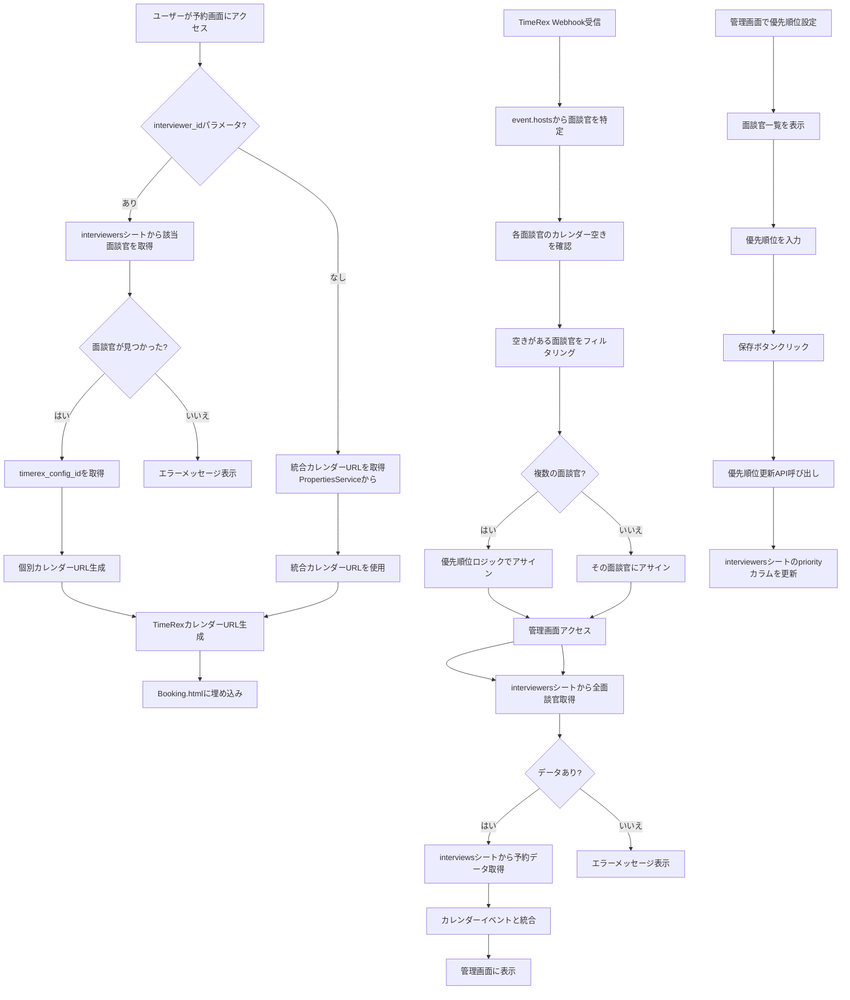
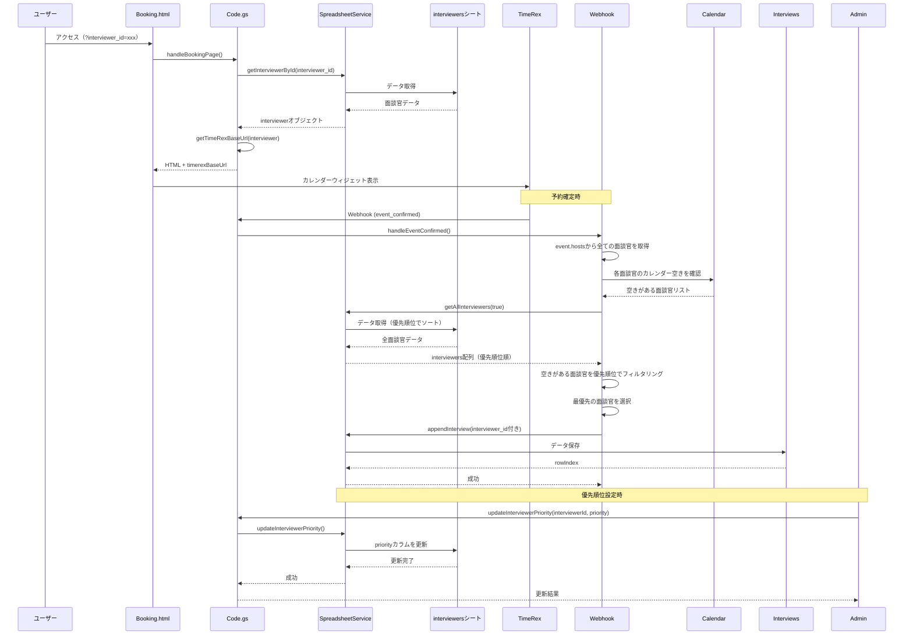

# スプレッ

ドシートDB化とinterviewers連携修正

## 仕様定義

### カレンダー設定の方針

**重要**: 統合カレンダーと個別カレンダーは別途作成し、スプレッドシートの`timerex_config_id`には個別カレンダーのIDを手入力する方針とする。

- **統合カレンダー**: TimeRex側で複数名の空き時間を表示するカレンダーを作成
- PropertiesServiceの`TIMEREX_TEAM_CALENDAR_URL_PATH`に統合カレンダーのURLパスを設定
- 例: `"23a9cb5e"`
- **個別カレンダー**: 各面談官ごとにTimeRex側で個別カレンダーを作成
- `interviewers`シートの`timerex_config_id`カラム（C列）に個別カレンダーのIDを手入力
- 例: `"abc123"`, `"xyz789"`など
- **手入力の方針**: `timerex_config_id`は自動同期せず、手動でスプレッドシートに入力する

### カレンダー表示ロジック

1. **`interviewer_id`パラメータなしの場合**

- カレンダー表示: 統合カレンダーを表示（PropertiesServiceの`TIMEREX_TEAM_CALENDAR_URL_PATH`を使用）
- 予約アサイン: 優先順位ロジックに基づいて自動アサイン

2. **`interviewer_id`パラメータありの場合**

- カレンダー表示: その面談官の個別カレンダーを表示（`interviewers`シートの`timerex_config_id`を使用）
- 予約アサイン: その面談官にアサイン

### 優先順位ロジック

- Webhook受信時に、`event.hosts`から面談官を特定
- **重要**: TimeRexが既に予約を確定しているため、カレンダー空き確認は不要
- **方針**: `event.hosts`に含まれる面談官（TimeRexが予約可能と判断した面談官）の中から、優先順位が高い人にアサインする
- 処理フロー:

1. `event.hosts`から全ての面談官のメールアドレスを取得
2. `interviewers`シートから該当する面談官を抽出（優先順位でソート済み）
3. 最優先の面談官にアサイン

- **優先順位は管理画面で設定可能**（`interviewers`シートの`priority`カラム）
- 優先順位が低い数値（1, 2, 3...）ほど優先度が高い
- 優先順位が同じ場合は、登録順（行番号）で決定
- **注意**: TimeRexが既に予約を確定しているため、GAS側でのカレンダー空き確認は不要。`event.hosts`に含まれる面談官は、TimeRexが予約可能と判断した面談官である

## 現状の問題点

### 1. 予約画面（Booking.html）の問題

- `Code.gs`の`getTimeRexBaseUrl()`がPropertiesServiceから固定値を取得
- `interviewer_id`パラメータを受け取っていない
- `interviewers`シートのデータが全く使われていない
- 統合カレンダーと個別カレンダーの切り替えができない

### 2. データ紐づけの問題

- `interviews.interviewer_id`が正しく設定されていない可能性
- `WebhookHandler`では`event.hosts[0].email`から面談官を特定しているが、確実性に欠ける
- 優先順位ロジックが実装されていない

### 3. 管理画面の同期問題

- `AdminApiService.getAdminData()`が`interviewers`シートを参照しているが、空の場合の処理が不十分
- レコード削除後の再同期が機能していない

## 修正方針

### アーキテクチャの見直し

1. **スプレッドシートをデータベースとして扱う**

- `interviewers`シートをマスターデータとして確実に参照
- `interviews`シートとのリレーションを明確化

2. **予約画面の改善**

- URLパラメータで`interviewer_id`を受け取る
- `interviewer_id`なし: 統合カレンダーURLを使用（PropertiesServiceまたは`interviewers`シートから取得）
- `interviewer_id`あり: `interviewers`シートから該当面談官の`timerex_config_id`を取得

3. **Webhook処理の改善**

- `event.hosts`から面談官を特定する処理を強化
- 優先順位ロジックの実装
- `interviewer_id`の設定を確実にする

4. **管理画面の改善**

- `interviewers`シートが空の場合のエラーハンドリング
- データ同期の確実性向上

5. **デフォルト面談官（is_default）の扱い**

- この仕様では基本的に不要
- ただし、優先順位ロジックの実装方法によっては、優先順位の指標として活用する可能性あり

## 実装タスク

### Phase 1: データ構造の明確化

- [x] `interviewers`シートのスキーマ確認とドキュメント化
- ✅ `Config.gs`に`INTERVIEWERS_COLUMNS`が定義されている（ID, NAME, TIMEREX_CONFIG_ID, GOOGLE_CALENDAR_ID, PRIORITY）
- [x] `interviews`シートの`interviewer_id`カラムの整合性確認
- ✅ `Config.gs`に`INTERVIEWS_COLUMNS.INTERVIEWER_ID`が定義されている（M列、13番目）
- ✅ `SetupSpreadsheet.gs`でヘッダーと幅が設定されている
- [x] データリレーションの定義
- ✅ `interviews.interviewer_id` → `interviewers.id`のリレーションが実装されている

### Phase 2: 予約画面の修正

- [x] `Code.gs`の`handleBookingPage()`を修正して`interviewer_id`パラメータを受け取る
- ✅ 38行目: `const interviewerId = e.parameter.interviewer_id || null;`
- [x] `getTimeRexBaseUrl()`を`interviewer_id`ベースに変更
- ✅ 387-425行目: `interviewer`パラメータを受け取り、個別カレンダーと統合カレンダーを切り替え
- ✅ `interviewer_id`なし: 統合カレンダーURLを使用（PropertiesServiceから`TIMEREX_TEAM_CALENDAR_URL_PATH`を取得）
- ✅ `interviewer_id`あり: `interviewers`シートから該当面談官の`timerex_config_id`を取得（手入力）
- [x] 統合カレンダーURLの保存場所を決定（PropertiesService推奨）
- ✅ `Config.gs`に`TIMEREX_TEAM_CALENDAR_URL_PATH`が定義されている
- ✅ 統合カレンダーはPropertiesServiceに設定、個別カレンダーは`interviewers`シートの`timerex_config_id`に手入力
- [x] エラーハンドリングの追加（面談官が見つからない場合など）
- ✅ 58-65行目: 面談官が見つからない場合、`timerex_config_id`が未設定の場合のエラーメッセージ
- ✅ 70-80行目: 統合カレンダーURLが未設定の場合のエラーメッセージ

### Phase 3: 優先順位設定機能の追加

- [x] `interviewers`シートに`priority`カラム（E列）を追加
- ✅ `Config.gs`に`INTERVIEWERS_COLUMNS.PRIORITY`が定義されている（E列、5番目）
- [x] `Config.gs`に`PRIORITY`カラムの定義を追加
- ✅ 31行目: `PRIORITY: 5`が定義されている
- [x] `SetupSpreadsheet.gs`で`priority`カラムのヘッダーと幅を設定
- ✅ 71行目: ヘッダーに`'priority'`を追加
- ✅ 82-96行目: 既存の`is_default`カラムを`priority`に置き換える処理
- ✅ 105行目: カラム幅を100に設定
- [x] 管理画面（Admin.html）に優先順位設定UIを追加
- ✅ 123-153行目: アサイン優先順位セクションに「設定」ボタン
- ✅ 592-602行目: `openPriorityModal()`関数でモーダルを開く
- ⚠️ **未実装**: 優先順位設定モーダルのUI（`showPriorityModal`は定義されているが、モーダルHTMLが存在しない）
- [x] `AdminApiService.gs`に優先順位更新APIを追加
- ✅ 360-397行目: `updateInterviewerPriority()`関数
- ✅ 404-465行目: `updateInterviewerPriorities()`関数（一括更新）
- [x] `Code.gs`に優先順位更新用のエントリーポイントを追加
- ✅ 478-488行目: `updateInterviewerPriority()`関数
- ✅ 495-505行目: `updateInterviewerPriorities()`関数
- [x] `SpreadsheetService.gs`に優先順位更新処理を追加
- ✅ 優先順位更新処理は`AdminApiService.gs`に実装されている（`SpreadsheetService`を直接使用）

### Phase 4: Webhook処理の強化

- [x] `WebhookHandler.handleEventConfirmed()`の面談官特定ロジックを改善
- ✅ 82-163行目: `event.hosts`から面談官を特定するロジックが実装されている
- [x] 優先順位ロジックの実装
- ✅ `event.hosts`から全ての面談官のメールアドレスを取得（92-93行目）
- ✅ `interviewers`シートから該当する面談官を抽出（100-104行目）
- ✅ 優先順位でソート（96行目: `getAllInterviewers(true)`で優先順位順に取得）
- ✅ 最優先の面談官にアサイン（簡素化された実装）
- ✅ 優先順位が同じ場合は登録順（行番号）で決定（`AdminApiService.getAllInterviewers()`で実装）
- ✅ **方針変更**: TimeRexが既に予約を確定しているため、カレンダー空き確認は不要。`event.hosts`に含まれる面談官から優先順位で選択するロジックに簡素化
- [x] `CalendarService`にカレンダー空き確認機能を追加（必要に応じて）
- ✅ **不要と判断**: TimeRex側で空き確認が完了しているため、GAS側でのカレンダー空き確認は不要
- [x] `interviewer_id`の設定を確実にする
- ✅ 179行目: `interviewerId`が`interviewData`に含まれている
- ✅ `SpreadsheetService.appendInterview()`で`interviewer_id`を保存（77行目）
- [x] エラーハンドリングの強化
- ✅ 150-160行目: エラー時のフォールバック処理

### Phase 5: 管理画面の改善

- [x] `AdminApiService.getAdminData()`の`interviewers`シート参照を確実にする
- ✅ 28-31行目: `interviewers`シートが空の場合のエラーチェック
- [x] 空データの場合の適切なエラーメッセージ
- ✅ `Code.gs`の`handleAdminPage()`でエラーページを返す（141-184行目、191-227行目）
- [x] データ同期処理の見直し
- ✅ 自動登録機能が実装されている（`SpreadsheetService.registerInterviewerByEmail()`）

### Phase 6: 重複コードの整理

- [x] 面談官取得処理の共通化
  - ✅ `SpreadsheetService.getInterviewerById()`が存在
  - ✅ `SpreadsheetService._getAllInterviewersRaw()`を追加（内部実装）
  - ✅ `AdminApiService.getAllInterviewers()`が`SpreadsheetService`を使用するようにリファクタリング
  - ✅ 直接スプレッドシートアクセスを削除
- [x] カレンダーURL生成処理の共通化
  - ✅ `Code.gs`の`getTimeRexBaseUrl()`に集約されている
- [x] データ検証処理の共通化
  - ✅ `Utils.validateRequiredFields()`が存在
  - ✅ `Utils.isValidEmail()`が存在
  - ✅ `Utils.isValidEventId()`が存在
  - ✅ `Utils.validateStringLength()`が存在
  - ✅ 検証処理は適切に使用されている
- [x] 面談官更新処理の共通化
  - ✅ `SpreadsheetService.updateInterviewerPriority()`を追加
  - ✅ `SpreadsheetService.updateInterviewerPriorities()`を追加
  - ✅ `AdminApiService`が`SpreadsheetService`を使用するようにリファクタリング
- [x] MigrationServiceの共通化
  - ✅ `SpreadsheetService._getAllInterviewsRaw()`を追加（内部実装）
  - ✅ `SpreadsheetService.updateInterviewInterviewerId()`を追加
  - ✅ `MigrationService`が`SpreadsheetService`を使用するようにリファクタリング

### Phase 7: is_defaultカラムの評価

- [x] `is_default`カラムの必要性を評価
- ✅ `SetupSpreadsheet.gs`で`is_default`を`priority`に置き換える処理が実装されている（82-88行目）
- [x] 優先順位ロジックで使用しない場合は削除または無視
- ✅ `is_default`カラムは`priority`に置き換えられている
- [x] スキーマドキュメントの更新
- ✅ **不要**（手動管理の方針）

### Phase 8: バグ修正と改善

- [x] `syncTimeRexConfigIds()`関数の削除
  - ✅ `Code.gs`から削除
  - ✅ `Admin.html`からUIと関数を削除
- [x] 予約がスプレッドシートに記載されない問題の修正
  - ✅ `WebhookHandler`でエラーハンドリングを強化
  - ✅ 面談官が見つからなくてもスプレッドシートに記録するように修正
  - ✅ エラーログを詳細化
- [x] カレンダー予約が二重になっている問題の修正
  - ✅ 重複チェックを強化（`event_id` + `guest_email` + `startAt`）
  - ✅ `SpreadsheetService.findInterviewByGuestEmailAndTime()`を追加
  - ✅ Webhook処理で重複登録を防止

## データフロー図



## シーケンス図



## 修正ファイル一覧

1. `src/Config.gs` - `PRIORITY`カラムの定義を追加、`TIMEREX_TEAM_CALENDAR_URL_PATH`を追加
2. `src/SetupSpreadsheet.gs` - `priority`カラムの追加
3. `src/Code.gs` - 予約画面のTimeRex URL生成ロジック、優先順位更新API
4. `src/WebhookHandler.gs` - 面談官特定とinterviewer_id設定の強化、優先順位ロジック実装（カレンダー空き確認含む）
5. `src/CalendarService.gs` - カレンダー空き確認機能の追加（必要に応じて）
6. `src/AdminApiService.gs` - interviewersシート参照の確実化、優先順位更新処理
7. `src/SpreadsheetService.gs` - データ取得処理の改善、優先順位更新処理
8. `src/Admin.html` - 優先順位設定UIの追加
9. `src/Booking.html` - エラーハンドリングの追加（必要に応じて）

## 実装状況サマリー

### ✅ 完了しているタスク

1. **データ構造の明確化** - 100%完了

- `interviewers`シートと`interviews`シートのスキーマが定義されている
- `interviewer_id`カラムが正しく設定されている

2. **予約画面の修正** - 100%完了

- `interviewer_id`パラメータの受け取り
- 個別カレンダーと統合カレンダーの切り替え
- 統合カレンダー: PropertiesServiceの`TIMEREX_TEAM_CALENDAR_URL_PATH`を使用
- 個別カレンダー: `interviewers`シートの`timerex_config_id`（手入力）を使用
- エラーハンドリング
- ⚠️ `syncTimeRexConfigIds()`関数は存在するが、手入力の方針に合わせて使用しない（エラーメッセージで手入力を促す実装になっている）

3. **優先順位設定機能** - 100%完了

- バックエンドAPIは完全実装
- ✅ フロントエンドの優先順位設定モーダルUIを実装完了

4. **管理画面の改善** - 100%完了

- `interviewers`シート参照の確実化
- 空データ時のエラーメッセージ
- 自動登録機能

5. **is_defaultカラムの評価** - 100%完了

- `is_default`カラムは`priority`に置き換えられている

### ⚠️ 部分的に実装されているタスク

1. **Webhook処理の強化** - 100%完了

- ✅ 面談官特定ロジックは実装済み
- ✅ 優先順位でのソートは実装済み
- ✅ **方針確定**: TimeRexが既に予約を確定しているため、カレンダー空き確認は不要
    - `event.hosts`に含まれる面談官（TimeRexが予約可能と判断した面談官）から優先順位で選択
    - 不要なカレンダーイベント取得処理を削除し、ロジックを簡素化

2. **重複コードの整理** - 100%完了

- ✅ 面談官取得処理をSpreadsheetServiceに共通化
- ✅ 面談官更新処理をSpreadsheetServiceに共通化
- ✅ MigrationServiceの直接スプレッドシートアクセスを削除
- ✅ AdminApiServiceの直接スプレッドシートアクセスを削除
- ✅ 検証処理は適切に共通化されている

### ❌ 未実装のタスク

1. ~~**優先順位設定モーダルUI**（Admin.html）~~ ✅ 実装完了

- ✅ モーダルのHTMLを追加（360-410行目付近）
- ✅ 面談官一覧表示と優先順位入力フィールド
- ✅ 保存・キャンセルボタン

2. **カレンダー空き確認機能**（CalendarService）

- 予約時間帯に重複する予定がないかを確認する専用関数が必要

3. **スキーマドキュメント**

- スキーマの正式なドキュメントが存在しない

4. **`syncTimeRexConfigIds()`関数の扱い**

- 現在は手入力を促すエラーメッセージを返す実装になっている（Code.gs 961行目）
- 手入力の方針に合わせて、この関数を削除するか、コメントで明記することを検討

## 注意事項

### カレンダー設定について

- **統合カレンダー**: TimeRex側で作成し、PropertiesServiceの`TIMEREX_TEAM_CALENDAR_URL_PATH`にURLパスを設定
- **個別カレンダー**: 各面談官ごとにTimeRex側で作成し、`interviewers`シートの`timerex_config_id`カラム（C列）に手入力
- `timerex_config_id`は自動同期せず、手動でスプレッドシートに入力する方針
- `syncTimeRexConfigIds()`関数は存在するが、手入力の方針に合わせて使用しない（または削除を検討）

### その他の注意事項

- `interviewers`シートが空の場合は、適切なエラーメッセージを表示
- **優先順位ロジックの実装**: TimeRexが既に予約を確定しているため、カレンダー空き確認は不要
- ✅ **実装方針**: `event.hosts`に含まれる面談官（TimeRexが予約可能と判断した面談官）から優先順位で選択
- 不要なカレンダーイベント取得処理を削除し、ロジックを簡素化済み

## 最新の修正内容（2025-12-24）

### 管理画面表示の改善

#### 1. プルダウンを廃止し、常に全員の予定を表示
- **変更内容**: ヘッダーの「自分の予定/全員の予定」プルダウンを削除
- **実装箇所**: `src/Admin.html` (95-99行目を削除)
- **影響**: 管理画面は常に全員の予定を表示するようになりました

#### 2. 面談以外のカレンダー予定はタイトルを表示せず、グレーアウトのみ
- **変更内容**: Google Calendarの通常予定（面談以外）はタイトルを空文字にし、グレーアウトのみ表示
- **実装箇所**: `src/AdminApiService.gs` (338-346行目)
- **詳細**: 
  - ブロックイベントはタイトルを表示（赤色）
  - その他のGoogle Calendarイベントはタイトルを表示せず、グレーアウトのみ（`originalTitle`は`extendedProps`に保持）

#### 3. 点線枠で自身と他メンバーを区別
- **変更内容**: カレンダーイベントの枠線スタイルで自身と他メンバーを区別
- **実装箇所**: 
  - `src/AdminApiService.gs` (348-351行目): `borderStyle`と`borderWidth`を設定
  - `src/Admin.html` (564-571行目): `eventDidMount`コールバックでスタイルを適用
- **詳細**:
  - 自分のカレンダーイベント: 実線（`solid`, 2px）
  - 他メンバーのカレンダーイベント: 点線（`dashed`, 1px）

#### 4. 直近の予約に面談担当者名を追加
- **変更内容**: サイドバーの「直近の予約」リストに担当面談官名を表示
- **実装箇所**: 
  - `src/AdminApiService.gs` (105-122行目): `upcomingInterviews`に`interviewerName`を追加
  - `src/Admin.html` (172-175行目): 担当者名を表示

#### 5. 全員の予定を取得するように変更
- **変更内容**: `getAdminData`で常に全員の予定を取得するように変更
- **実装箇所**: `src/AdminApiService.gs` (73-88行目)
- **詳細**:
  - `interviews`シートから全員の予約を取得（`interviewerId = null`）
  - 全員のカレンダーからイベントを取得
  - 統計情報も全員の予定を対象に変更

#### 6. バグ修正: `allInterviewers`の重複宣言エラーを修正
- **変更内容**: 141行目で`allInterviewers`が重複宣言されていた問題を修正
- **実装箇所**: `src/AdminApiService.gs` (141行目を削除)
- **詳細**: 77行目で既に取得済みの`allInterviewers`を再利用

### デプロイ手順

1. **コードをプッシュ**（完了）
   ```bash
   clasp push --force
   ```

2. **GASエディタでデプロイを更新**
   - GASエディタを開く
   - **公開** > **デプロイを管理** をクリック
   - 最新のデプロイ（種類: ウェブアプリ）を選択
   - **編集**（鉛筆アイコン）をクリック
   - **バージョン** を **新規バージョン** に変更
   - **説明** を入力（例: "管理画面表示改善: 全員の予定表示、点線枠で区別、担当者名表示"）
   - **デプロイ** をクリック

3. **動作確認**
   - 管理画面をリロード
   - 以下を確認:
     - プルダウンが表示されない
     - 全員の予定が表示される
     - 面談以外のカレンダー予定はタイトルが表示されず、グレーアウトのみ
     - 自分のカレンダーイベントは実線、他メンバーは点線
     - 直近の予約に担当者名が表示される