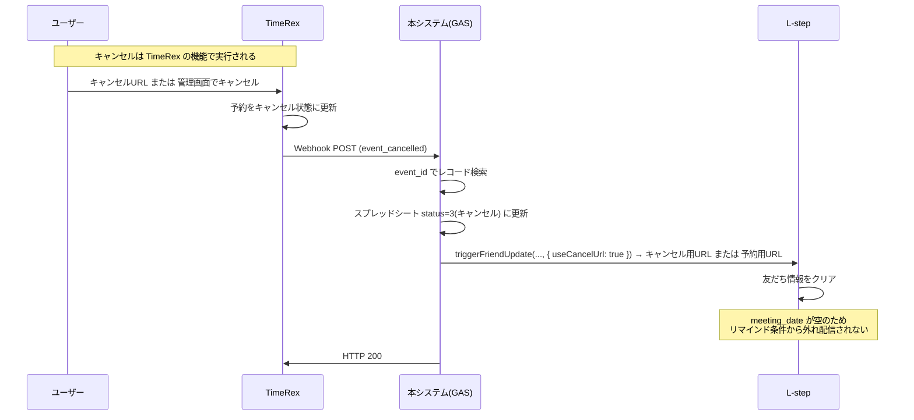

# TimeRex・GAS・L-step 責任分界とリマインド連携設計

予約・キャンセルの「実行主体」と、本システム（GAS）および L-step の役割を明確にし、**予約キャンセルは TimeRex の機能である**ことを前提とした設計をまとめる。

---

## 1. 責任分界（誰が何をするか）

| 役割 | 担当 | 説明 |
|------|------|------|
| **予約の作成** | **TimeRex** | カレンダーウィジェット・API による予約受付。予約データと Meet URL の保持。 |
| **予約のキャンセル** | **TimeRex** | キャンセル操作とキャンセル状態の管理は **TimeRex の機能**。ゲスト用キャンセルURL・ホスト管理画面などで実行。 |
| **キャンセル発生の通知** | **TimeRex** | キャンセル実行後、本システムの Webhook URL へ `event_cancelled` を POST。 |
| **Webhook 受信と後処理** | **本システム（GAS）** | TimeRex の Webhook を受信し、スプレッドシート更新と L-step 連携を行う。**キャンセルを「実行」するのではなく「通知に反応」するだけ**。 |
| **リマインド配信** | **L-step** | 友だち情報 `meeting_date` を条件にリマインドを送信。`meeting_date` が空になると条件から外れ配信停止。 |

### 重要ポイント

- **予約キャンセルは TimeRex の機能である。** 本システムはキャンセルを実行せず、TimeRex がキャンセルした結果を Webhook で受け取り、自前データ（スプレッドシート）と L-step（リマインド）を同期する。
- キャンセルが行われる「窓口」は TimeRex（ゲスト用キャンセルURL・ホスト用管理画面など）。LINE メッセージ内の `{{meeting_cancel_url}}` も TimeRex のキャンセルURL へのリンクであり、クリックすると TimeRex 上でキャンセルが実行される。

---

## 2. システム構成とデータフロー

```
┌─────────────────────────────────────────────────────────────────────────────┐
│ 予約・キャンセルの「実行」はすべて TimeRex が担当                              │
└─────────────────────────────────────────────────────────────────────────────┘

【予約確定時】
  ユーザー → [TimeRex ウィジェット] → 予約確定（TimeRex が状態を「確定」に）
       → TimeRex が Webhook (event_confirmed) を GAS に POST
       → GAS: スプレッドシート記録 + L-step に meeting_date / meeting_url / meeting_cancel_url を送信
       → L-step: 友だち情報更新・タグ付与・リマインド条件（meeting_date あり）を満たす

【予約キャンセル時】※キャンセル実行は TimeRex
  ユーザー → [TimeRex キャンセルURL または 管理画面] → キャンセル実行（TimeRex が状態を「キャンセル」に）
       → TimeRex が Webhook (event_cancelled) を GAS に POST
       → GAS: スプレッドシートの status を「キャンセル」に更新
       → GAS: L-step に meeting_date=null, meeting_url=null, meeting_cancel_url=null を送信
       → L-step: 友だち情報がクリアされ、リマインド条件（meeting_date に値があること）から外れる → リマインド配信停止
```

---

## 3. 予約キャンセル時の処理詳細

### 3.1 キャンセルが発生する場所（TimeRex）

- **ゲスト**: TimeRex のキャンセルURL（`event.guest_cancel_url`）、または LINE 配信内の `{{meeting_cancel_url}}` をクリック
- **ホスト**: TimeRex 管理画面から予定をキャンセル

いずれも **TimeRex 上でキャンセルが実行**され、TimeRex がイベント状態を「キャンセル」に更新する。

### 3.2 本システム（GAS）の役割

1. **Webhook 受信**  
   TimeRex が POST する `event_cancelled` を `doPost` で受信。

2. **スプレッドシート更新**  
   `event_id` で該当レコードを検索し、`status` を「3（キャンセル）」に更新。

3. **L-step 連携（リマインド解除に相当）**  
   該当レコードの `line_uid` を取得し、**キャンセル用トリガーURL**（`LSTEP_CANCEL_TRIGGER_URL`。未設定時は `LSTEP_TRIGGER_URL`）に次を送信する。  
   `meeting_date: null`, `meeting_url: null`, `meeting_cancel_url: null`  
   → L-step の友だち情報がクリアされ、**リマインドの条件（meeting_date に値があること）から外れる**ため、リマインドは送信されない。  
   **キャンセル用エンドポイント**では、連携アクションを「友だち情報の更新のみ」とし、予約時メッセージ・タグ・リマインダは紐づけないこと（意図しないメッセージ送信を防ぐ）。詳細は [LSTEP_SPEC_GUIDE.md](../lstep/LSTEP_SPEC_GUIDE.md) を参照。

### 3.3 リマインドが止まる仕組み

- L-step 側でリマインドの**ゴール日（条件）**に **パラメータ `meeting_date`** を設定する。
- リマインド配信の条件を「**`meeting_date` に値が入っていること**」にする。
- キャンセル時に GAS が `meeting_date: null` を送ると、L-step の友だち情報の `meeting_date` が空になる。
- 条件を満たさなくなるため、**既存のリマインド設定は「解除」されたのと同様に配信されない**。

※L-step に「リマインドを削除する」専用APIがあるわけではなく、**条件ベースで配信する設計**にすることで、null を送るだけで解除相当の動作を実現している。

---

## 4. シーケンス図

### 4.1 予約キャンセル〜リマインド停止まで



---

## 5. 前提条件・設定

### 5.1 L-step 側

- リマインドの**ゴール日**に **パラメータ `meeting_date`** を設定する。
- リマインド配信の条件を「**`meeting_date` に値が入っていること**」にする。
- 詳細は [LSTEP_API_SETUP_GUIDE.md](../lstep/LSTEP_API_SETUP_GUIDE.md) の「リマインド操作」を参照。

### 5.2 本システム（GAS）側

- **`Config.LSTEP_UID_ONLY`** が `false` であること。  
  `true` の場合、キャンセル時の友だち情報クリア（＝リマインド停止のための L-step 連携）は実行されない。
- TimeRex の Webhook URL に、本システムの `doPost` が応答する URL を設定すること。
- キャンセル時に L-step 連携を行うには、該当予約レコードに **`line_uid`** が保存されている必要がある（予約確定時に `url_params` で渡された LINE UID が記録されていること）。
- **LSTEP_CANCEL_TRIGGER_URL** を設定すると、キャンセル時はその URL を呼ぶ。未設定時は LSTEP_TRIGGER_URL にフォールバック。キャンセル時に予約時メッセージを送りたくない場合は、L-step にキャンセル用エンドポイントを用意し、その URL を設定すること。

### 5.3 TimeRex 側

- 予約確定・キャンセル時に Webhook が送信されるよう、Webhook URL を設定すること。
- ゲスト用キャンセルURL（`guest_cancel_url`）は、LINE 配信で `{{meeting_cancel_url}}` として案内すると、ユーザーが LINE 上からキャンセルできる。

---

## 6. 関連ドキュメント

| ドキュメント | 内容 |
|-------------|------|
| [spec.md](../spec.md) | 全体仕様・データフロー・Webhook ペイロード |
| [LSTEP_SPEC_GUIDE.md](../lstep/LSTEP_SPEC_GUIDE.md) | L-step 連携の詳細仕様（エンドポイント種別・キャンセル用・パラメータ） |
| [LSTEP_API_SETUP_GUIDE.md](../lstep/LSTEP_API_SETUP_GUIDE.md) | L-step 管理画面でのエンドポイント・パラメータ・リマインド設定手順 |
| [LSTEP_INTEGRATION.md](../lstep/LSTEP_INTEGRATION.md) | L-step 連携全体・リマインド配信の実装パターン・キャンセル時の処理 |
| [TIMEREX_LSTEP_TEST_PROCEDURE.md](../operations/TIMEREX_LSTEP_TEST_PROCEDURE.md) | 本設計に基づくテスト手順（モック・E2E・キャンセル時リマインド解除の確認） |
| [WEBHOOK_ARCHITECTURE.md](../webhook/WEBHOOK_ARCHITECTURE.md) | Webhook 受信の入口（本ドキュメントでは TimeRex Webhook を想定） |

---

*本設計は、予約キャンセルが TimeRex の機能であることを前提に、GAS と L-step の責任範囲とキャンセル時のリマインド解除の流れを定義したものである。*
