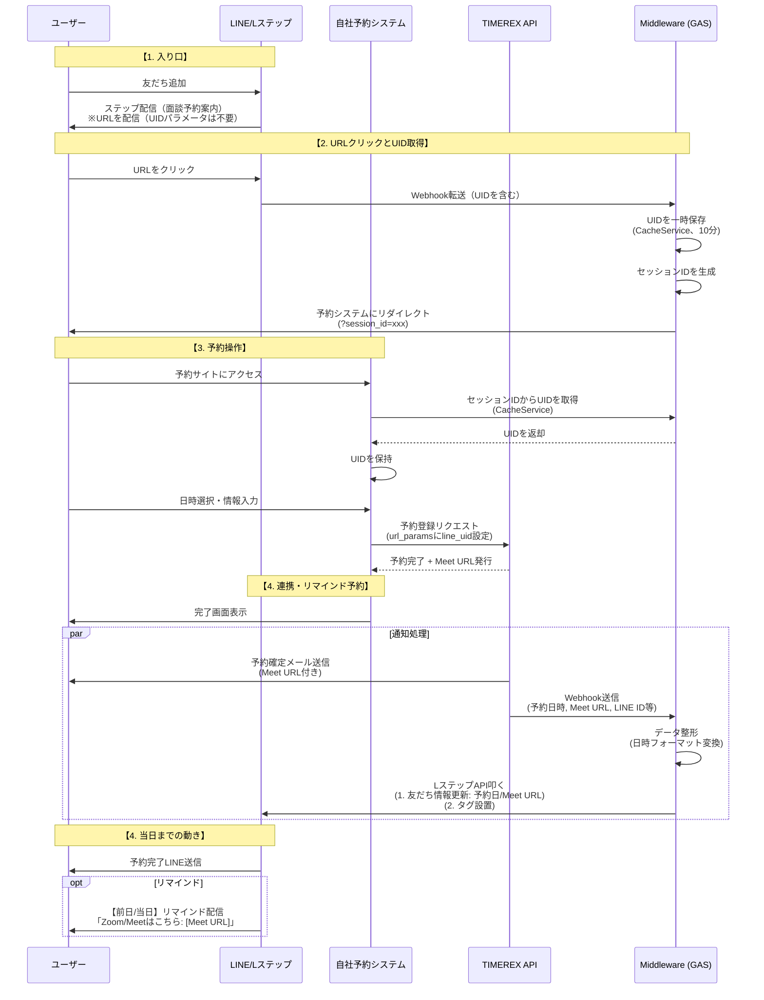
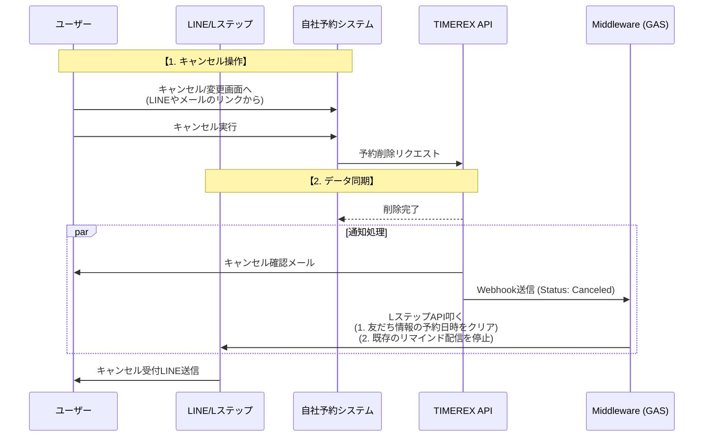
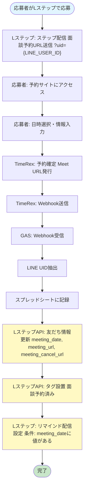
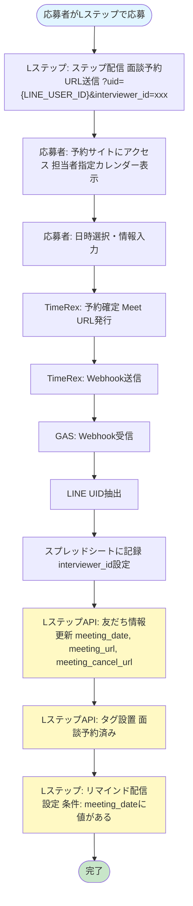
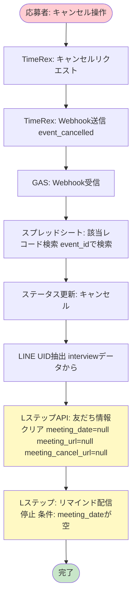
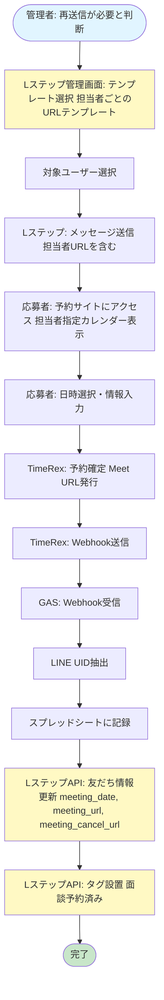

# Lステップ連携設計書

## 概要

TIMEREX API（予約エンジン・Googleカレンダー連携・Meet URL発行）とLステップAPIを連携させ、**自動割り当て**と**Meet URL自動発行・配信**を実現する統合設計。

**重要:** 本設計では**LステップWebhook転送を使用してUIDを取得**します（パターンB）。URLクリック時にLステップのWebhook転送でUIDを取得し、予約システム側で保持します。予約確定時（TIMEREX Webhook受信時）にLステップAPIを呼び出して友だち情報更新・タグ設置を行います。

### 連携の目的

- ✅ 予約確定時の自動処理（手動コピペの排除）
- ✅ Meet URLの自動発行とLINE配信
- ✅ リマインド配信の自動設定・管理
- ✅ キャンセル時の自動データ同期
- ✅ 予約確定時のタグ自動設置

### システム構成

```
[LINE/Lステップ] 
  ↓ (URL配信: ?uid={LINE_USER_ID}&interviewer_id=xxx)
[自社予約システム (React/Vue/GAS)]
  ↓ (予約登録リクエスト)
[TIMEREX API]
  ↓ (予約確定 + Meet URL発行)
[TIMEREX Webhook] → [Middleware (GAS)]
                      ↓
                  [LステップAPI]
                      ↓
                  [LINE配信・リマインド設定]
```

---

## 業務フロー

### 面談予約フロー



### キャンセル・変更フロー



---

## LINEユーザーIDの受け渡し（最重要ポイント）

この仕組みを成功させるための「鍵」は、**LINEユーザーID（uid）をいかにしてTIMEREX（自社システム）まで運び、またLステップに戻すか**です。

### データフローの全体像

LINEユーザーID（`uid`）を以下の4つのポイントで受け渡します：

1. **Lステップ → GAS**: Webhook転送経由（URLクリック時）
2. **GAS → 自社システム**: セッションID経由（CacheServiceでUIDを一時保存）
3. **自社システム → TIMEREX**: `url_params`経由（TimeRexウィジェット設定）
4. **TIMEREX → Middleware → Lステップ**: Webhookデータ経由

### 【ステップ1】Lステップからの送り出しとUID取得

**重要:** [LステップAPI連携の公式記事](https://linestep.jp/2025/12/08/lstep_api/)によると、**Webhook転送でUIDを転送することしかできない**ため、URLパラメータに直接UIDを含める方法は使用できません。

**設定手順:**

1. **Lステップ側の設定:**
   - シナリオ配信または一斉配信でURLを配信（UIDパラメータは不要）
   - URL例: `https://script.google.com/macros/s/{SCRIPT_ID}/exec?interviewer_id={INTERVIEWER_ID}`
   - 「Webhook転送」を設定:
     - アクション: 「URLクリック」または「ボタンタップ」
     - 転送先: `https://script.google.com/macros/s/{SCRIPT_ID}/exec?action=lstep_webhook`
     - ペイロードにUIDが含まれることを確認

2. **GAS側の実装:**
   - Webhook転送受信エンドポイントを作成
   - UIDを一時保存（CacheService、有効期限: 10分）
   - セッションIDを生成して予約システムにリダイレクト

### 【ステップ2】GASでのUID取得とリダイレクト

**実装要件:**

1. **Webhook転送の受信**
   - `doGet`または`doPost`で`action=lstep_webhook`を処理
   - ペイロードからUIDを抽出（Lステップの仕様に依存）

2. **UIDの一時保存**
   - CacheServiceにUIDを保存（有効期限: 10分）
   - セッションIDを生成（UUID）

3. **予約システムへのリダイレクト**
   - セッションIDをパラメータとして含める
   - 担当者指定がある場合は`interviewer_id`も含める

### 【ステップ3】自社システムでの保持と転送

**実装要件:**

1. **セッションIDからUIDを取得**
   - ランディング時にセッションIDパラメータを取得
   - CacheServiceからUIDを取得
   - セッションストレージやローカルステートで保持

2. **TIMEREX APIへの送信**
   - 予約確定時に、TimeRexウィジェットの`url_params`に`line_uid`を設定
   - TimeRex標準UIを埋め込んでいる場合は、TimeRexの「設問項目（隠し項目）」機能を使用

**実装例（JavaScript/React）:**

```javascript
// URLパラメータの取得
const searchParams = new URLSearchParams(window.location.search);
const lineId = searchParams.get('uid') || searchParams.get('line_id');

// セッションストレージに保存（ページ遷移後も保持）
if (lineId) {
  sessionStorage.setItem('line_uid', lineId);
}

// TIMEREX APIへの予約登録リクエスト例
const bookingData = {
  start_time: selectedDateTime,
  guest_name: guestName,
  guest_email: guestEmail,
  // カスタムデータとしてLINE IDを含める
  custom_data: {
    line_uid: sessionStorage.getItem('line_uid')
  },
  // または備考欄に含める（TIMEREX API仕様に合わせる）
  notes: `LINE ID: ${sessionStorage.getItem('line_uid')}`
};

await fetch('https://timerex.net/api/beta/events', {
  method: 'POST',
  headers: {
    'x-api-key': TIMEREX_API_KEY,
    'Content-Type': 'application/json'
  },
  body: JSON.stringify(bookingData)
});
```

**GAS版（TimeRexウィジェット使用時）:**

現在のGAS実装では、セッションIDからUIDを取得し、TimeRexウィジェットの `url_params` にLINE IDを設定しています：

```javascript
// Code.gs内の実装例
function handleBookingPage(e) {
  let uid = '';
  
  // セッションIDからUIDを取得
  const sessionId = e.parameter.session_id;
  if (sessionId) {
    const cache = CacheService.getScriptCache();
    uid = cache.get(`uid_${sessionId}`) || '';
  }
  
  // 後方互換性: URLパラメータからも取得を試行
  if (!uid) {
    uid = e.parameter.uid || '';
  }
  
  const userData = {
    uid: uid,
    // ...
  };
  // ...
}

// Booking.html内の実装例（参考）
const widgetConfig = {
  'locale': 'ja',
  'url_params': {
    'line_uid': uid.value  // LINE IDをurl_paramsに設定
  }
};
```

この `url_params` は、TimeRexのWebhookデータ内で `event.url_params` として取得できます。

### 【ステップ3】Middlewareでの処理とLステップへの連携

TIMEREX Webhookを受信したMiddleware（GAS）で、以下を実行します：

1. **Webhookデータの解析**
   - `line_uid` を抽出（`url_params`、カスタムデータ、または備考欄から）
   - `meet_url`、`start_time`、`end_time`、`guest_cancel_url` を取得

2. **LステップAPIへの連携**
   - `v1/friend/update` エンドポイントを呼び出し
   - 友だち情報に `meeting_date`、`meeting_url`、`meeting_cancel_url` を更新
   - `meeting_cancel_url` はTimeRexの `guest_cancel_url` から取得

**実装例（Google Apps Script）:**

実際の実装は `src/LStepApiService.gs` と `src/WebhookHandler.gs` を参照してください。

#### WebhookHandler.gs での使用例

```javascript
// 予約確定時
if (lineUid) {
  try {
    // 日時をLステップ形式にフォーマット
    const meetingDate = LStepApiService.formatDateTimeForLStep(startAt);
    
    // 友だち情報を更新
    // 注意: LステップAPIの仕様に応じて、useLstepIdをtrueに設定する場合があります
    // 例: LStepApiService.updateFriendInfo(lineUid, {...}, true); // lstepidとして扱う
    LStepApiService.updateFriendInfo(lineUid, {
      meeting_date: meetingDate,
      meeting_url: meetUrl || null,
      meeting_cancel_url: event.guest_cancel_url || null
    });
    
    // タグを設置
    const tagName = Config.LSTEP_TAG_NAMES.BOOKING_CONFIRMED;
    // 注意: LステップAPIの仕様に応じて、useLstepIdをtrueに設定する場合があります
    LStepApiService.addTag(lineUid, tagName);
  } catch (lstepError) {
    Logger.log(`LステップAPI連携エラー（無視）: ${lstepError.toString()}`);
    // LステップAPI連携失敗は予約処理を止めない
  }
}

// キャンセル時
if (lineUid) {
  try {
    // 友だち情報をクリア
    // 注意: LステップAPIの仕様に応じて、useLstepIdをtrueに設定する場合があります
    LStepApiService.updateFriendInfo(lineUid, {
      meeting_date: null,
      meeting_url: null,
      meeting_cancel_url: null
    });
  } catch (lstepError) {
    Logger.log(`LステップAPI連携エラー（キャンセル、無視）: ${lstepError.toString()}`);
    // LステップAPI連携失敗はキャンセル処理を止めない
  }
}
```

#### LINE UID抽出（Utils.gs）

```javascript
// url_params配列からLINE UIDを取得
const lineUid = Utils.getUrlParamValue(event.url_params, 'line_uid');
```

---

## URLパラメータの記述ルール

### 基本ルール

- **最初のパラメータ**: `?` で始める
- **2つ目以降のパラメータ**: `&` でつなぐ

### 推奨パターン: uidを先頭にする

**基本URL:**
```
https://example.com/booking?uid={LINE_USER_ID}
```
※`{LINE_USER_ID}`はLステップの変数を使用（具体的な記法はマニュアル参照）

**担当者指定がある場合:**
```
https://example.com/booking?uid={LINE_USER_ID}&interviewer_id=y_haraguchi
```

**利点:**
- ベースURLが常に同じ形で運用ミスが少ない
- 担当者指定がない場合はそのまま使用
- 担当者指定がある場合は末尾に `&interviewer_id=xxx` を追加するだけ

### 代替パターン: 担当者IDを先頭にする場合

もし業務上、担当者IDを先頭にする必要がある場合：

```
https://example.com/booking?interviewer_id=y_haraguchi&uid={LINE_USER_ID}
```
※`{LINE_USER_ID}`はLステップの変数を使用（具体的な記法はマニュアル参照）

### システム側での受け取り（順序非依存）

フロントエンドでは、パラメータの順序に関係なく取得できるように実装します：

```javascript
// URL例: https://example.com/booking?uid=U12345&interviewer_id=y_haraguchi
// 順序が逆でも機能します

const searchParams = new URLSearchParams(window.location.search);

const uid = searchParams.get('uid') || searchParams.get('line_id'); // "U12345"
const interviewerId = searchParams.get('interviewer_id'); // "y_haraguchi" または null

// データ保持
if (uid) {
  sessionStorage.setItem('line_uid', uid);
}

if (interviewerId) {
  sessionStorage.setItem('interviewer_id', interviewerId);
  // 担当者指定モードとして処理
} else {
  // 通常予約モード（統合カレンダー）として処理
}
```

---

## リマインド配信の実装パターン

### 条件設定方式（推奨）

Lステップ側で以下のように設定：

**リマインド配信の条件:**
- ゴール設定: `meeting_date` という友だち情報に日付が入っていること

**配信タイミング:**
- 前日: `meeting_date - 1日`
- 当日: `meeting_date` の当日朝

**配信内容:**
```
面談は本日 {{meeting_date}} です。
Zoom/Meet URL: {{meeting_url}}

キャンセルはこちら: {{meeting_cancel_url}}
```

### キャンセル時の処理

キャンセルが発生したら、Middleware経由でLステップAPIを叩き、対象ユーザーの `meeting_date` を **空（null）** または **過去の日付** に上書きします。

これにより、リマインドの条件から自動的に外れ、配信が停止されます。

```javascript
// キャンセル時の処理例
updateLStepFriendInfo(lineUid, {
  meeting_date: null, // または ''
  meeting_url: null,
  meeting_cancel_url: null
});
```

---

## 設定手順

### 1. Lステップ側の設定

1. **ステップ配信URLの設定**
   - URLに `?uid={LINE_USER_ID}` を設定（Lステップの変数を使用）
   - 担当者指定がある場合は `&interviewer_id=xxx` を追加

2. **リマインド配信の条件設定**
   - ゴール設定: `meeting_date` という友だち情報に日付が入っていること
   - 配信タイミング: 前日/当日を設定
   - 配信内容に `{{meeting_url}}` と `{{meeting_cancel_url}}` を含める

### 2. GAS側の設定

1. **スクリプトプロパティにLステップAPIキーを設定**

```javascript
setScriptProperties({
  LSTEP_API_KEY: 'your-lstep-api-key'
});
```

2. **WebhookハンドラにLステップ連携ロジックを追加**

   - `extractLineUid()` 関数を実装
   - `updateLStepFriendInfo()` 関数を実装
   - `doPost()` 内でLステップAPI呼び出しを追加

### 3. テスト手順

1. **予約確定フローのテスト**
   - Lステップから予約URLにアクセス
   - 予約を確定
   - Webhookが受信されることを確認
   - Lステップの友だち情報が更新されることを確認

2. **リマインド配信のテスト**
   - 予約確定後、`meeting_date` が設定されることを確認
   - リマインド条件が満たされていることを確認（手動テスト）

3. **キャンセルフローのテスト**
   - 予約をキャンセル
   - Webhookが受信されることを確認
   - `meeting_date` がクリアされることを確認

---

## 実装チェックリスト

### Lステップ側の設定

- [ ] ステップ配信URLに `?uid={LINE_USER_ID}` を設定（Lステップの変数を使用）
- [ ] 担当者指定がある場合は `&interviewer_id=xxx` を追加
- [ ] リマインド配信の条件を `meeting_date` に設定
- [ ] リマインドメッセージに `{{meeting_url}}` と `{{meeting_cancel_url}}` を含める（LINEからキャンセル可能にするため）

### 自社予約システム側の実装

- [ ] URLパラメータから `uid` を取得
- [ ] セッションストレージなどで `uid` を保持
- [ ] TIMEREX APIへの予約登録時に `line_uid` を含める
  - [ ] `url_params` に設定（GAS版）
  - [ ] カスタムデータフィールド使用、または
  - [ ] 備考欄に含める、または
  - [ ] TIMEREX設問項目（隠し項目）を使用

### Middleware（GAS）側の実装

- [ ] TIMEREX Webhook受信エンドポイントを実装
- [ ] Webhookデータから `line_uid` を抽出するロジック
  - [ ] `event.url_params.line_uid` から取得
  - [ ] `event.url_params.uid` から取得
  - [ ] `event.custom_data.line_uid` から取得
  - [ ] `event.notes` から正規表現で抽出
- [ ] LステップAPI認証情報（APIキー）の設定
- [ ] `v1/friend/update` エンドポイントの呼び出し実装
- [ ] 日時フォーマット変換ロジック
- [ ] エラーハンドリングとログ出力

### テスト項目

- [ ] 予約確定時にLINE IDが正しく伝播するか
- [ ] Meet URLがLステップに正しく登録されるか
- [ ] 予約確定時にタグが正しく設置されるか
- [ ] リマインド配信が正しいタイミングで実行されるか
- [ ] キャンセル時に `meeting_date` がクリアされるか
- [ ] キャンセル後にリマインドが停止されるか
- [ ] LステップAPI呼び出し失敗時も予約処理が継続されるか

---

## トラブルシューティング

### LINE IDが取得できない

**症状:** Webhookで `line_uid` が `null` になる

**確認ポイント:**
1. LステップのURL設定で変数が正しく記述されているか（具体的な記法はマニュアル参照）
2. 自社システムでURLパラメータを正しく取得・保持しているか
3. TIMEREX APIへの送信時に `line_uid` を含めているか
4. Webhookデータのどのフィールドに `line_uid` が含まれるか確認（デバッグログで確認）
   - `event.url_params.line_uid`
   - `event.url_params.uid`
   - `event.custom_data.line_uid`
   - `event.notes`

**デバッグ方法:**
```javascript
function doPost(e) {
  const webhookData = JSON.parse(e.postData.contents);
  const event = webhookData.event;
  
  // デバッグ用: Webhookデータ全体をログに出力
  Logger.log('Webhook data: ' + JSON.stringify(webhookData, null, 2));
  Logger.log('url_params: ' + JSON.stringify(event.url_params));
  Logger.log('custom_data: ' + JSON.stringify(event.custom_data));
  Logger.log('notes: ' + event.notes);
  
  // ... 後続処理
}
```

### リマインドが配信されない

**症状:** 予約確定後もリマインドメッセージが届かない

**確認ポイント:**
1. Lステップのリマインド条件設定を確認（`meeting_date` に値が入っているか）
2. `meeting_date` のフォーマットがLステップの仕様に合っているか
3. リマインド配信のタイミング設定（前日/当日）が正しいか
4. Lステップ管理画面で友だち情報を確認し、`meeting_date` が正しく設定されているか

### キャンセル後もリマインドが届く

**症状:** キャンセル後にリマインドメッセージが届いてしまう

**確認ポイント:**
1. キャンセルWebhookが正しく受信されているか
2. `meeting_date` が `null` または空文字列に更新されているか
3. Lステップの条件設定で `meeting_date` が空の場合は配信しない設定になっているか
4. Lステップ管理画面で友だち情報を確認し、`meeting_date` がクリアされているか

### LステップAPIエラー

**症状:** `LStepApiService.updateFriendInfo()` または `LStepApiService.addTag()` でエラーが発生する

**確認ポイント:**
1. `LSTEP_API_KEY` が正しく設定されているか
   ```javascript
   // GASエディタで確認
   PropertiesService.getScriptProperties().getProperty('LSTEP_API_KEY');
   ```
2. APIキーの権限が `v1/friend/update` を実行できるか
3. **識別子（uidまたはlstepid）が正しいか**
   - LステップAPIの仕様により、`uid`（LINEユーザーID）または`lstepid`（LステップID）のどちらを使うかが異なる場合があります
   - 変数で取得できる値がLINEユーザーID（`U12345...`）なのか、LステップIDなのかを確認
   - **重要**: LステップAPI連携では、UIDまたはfriendIDを必ず使用する必要があります
   - 外部システムでもUIDを把握していることが必須です（本システムではTimeRex Webhookから取得）
   - `lstepid`を使う場合は、`useLstepId = true`を指定:
     ```javascript
     LStepApiService.updateFriendInfo(identifier, data, true); // lstepidとして扱う
     ```
4. リクエストのペイロード形式がLステップAPI仕様に合っているか
5. レスポンスコードとエラーメッセージを確認（ログを確認）
6. レート制限に達していないか（429エラーの場合）

**エラーハンドリング:**
- 実装では、LステップAPI呼び出し失敗時も予約処理は継続されます（ログ出力のみ）
- 指数バックオフによるリトライが自動実行されます（最大3回）
- エラーログは `Utils.logError()` で記録されます

**デバッグ方法:**
```javascript
// WebhookHandler.gs のログを確認
Logger.log(`[WebhookHandler] LステップAPI連携エラー: ${lstepError.toString()}`);
```

### タグが設置されない

**症状:** 予約確定後もタグが設置されない

**確認ポイント:**
1. LステップAPIのタグ追加エンドポイントが正しいか（`/friend/tag/add`）
2. タグ名がLステップ側で定義されているか
3. APIキーの権限がタグ操作を実行できるか
4. ログでエラーが出力されていないか確認

**注意:**
- タグ追加失敗時も予約処理は継続されます（警告のみ）
- タグAPIのエンドポイントは実際のLステップAPI仕様に合わせて調整が必要です

---

## アクティビティ図

### パターン1: 通常の面談予約フロー（統合カレンダー）



### パターン2: 担当者指定の面談予約フロー



### パターン3: キャンセルフロー



### パターン4: 再送信フロー（手動、Lステップ側で操作）



---

## 実装詳細

### LStepApiService.gs

LステップAPI連携サービス。以下の機能を提供します。

#### 主要メソッド

- `updateFriendInfo(identifier, data, useLstepId = false)`: 友だち情報更新（`v1/friend/update`）
  - `identifier`: LINEユーザーID（`uid`）またはLステップID（`lstepid`）
  - `useLstepId`: `true`の場合、`identifier`を`lstepid`として扱う（デフォルト: `false`、`uid`として扱う）
  - `data.meeting_date`: 面談日時（Lステップ形式: "YYYY-MM-DD HH:mm:ss"）
  - `data.meeting_url`: ミーティングURL
  - `data.meeting_cancel_url`: キャンセルURL（TimeRexの`guest_cancel_url`）
- `addTag(identifier, tagName, useLstepId = false)`: タグ追加（`v1/friend/tag/add`、仕様要確認）
- `removeTag(identifier, tagName, useLstepId = false)`: タグ削除（`v1/friend/tag/remove`、仕様要確認）
- `formatDateTimeForLStep(datetime)`: 日時フォーマット変換（TIMEREX形式 → Lステップ形式）

**重要:** LステップAPIの仕様により、`uid`（LINEユーザーID）または`lstepid`（LステップID）のどちらを使うかが異なる場合があります。実際のAPI仕様に合わせて`useLstepId`パラメータを設定してください。

#### エラーハンドリング

- 指数バックオフによるリトライ（最大3回）
- 429（Rate Limit）または5xxエラーの場合のみリトライ
- タグ操作失敗時は警告のみ（予約処理は継続）

### WebhookHandler.gs

TIMEREX Webhook受信時にLステップAPIを呼び出します。

#### 予約確定時（`handleEventConfirmed`）

1. LINE UID抽出（`event.url_params`から）
2. スプレッドシートに記録
3. LステップAPI呼び出し:
   - 友だち情報更新（`meeting_date`, `meeting_url`, `meeting_cancel_url`）
   - タグ設置（`Config.LSTEP_TAG_NAMES.BOOKING_CONFIRMED`）

#### キャンセル時（`handleEventCancelled`）

1. スプレッドシートから該当レコードを検索
2. ステータスをキャンセルに更新
3. LINE UID抽出（`interview.data.lineUid`から）
4. LステップAPI呼び出し:
   - 友だち情報クリア（`meeting_date=null`, `meeting_url=null`, `meeting_cancel_url=null`）

#### エラーハンドリング

- LステップAPI呼び出し失敗時も予約処理は継続（ログ出力のみ）
- エラーログを`Utils.logError()`で記録

### Config.gs

LステップAPI関連の設定を追加。

```javascript
PROPERTY_KEYS: {
  // ... 既存
  LSTEP_API_KEY: 'LSTEP_API_KEY'
},
LSTEP_API_BASE_URL: 'https://api.lineml.jp/v1',
LSTEP_TAG_NAMES: {
  BOOKING_CONFIRMED: '面談予約済み'
}
```

---

## TimeRexでのキャンセル方法

### キャンセル方法の種類

TimeRexでは、以下の方法でキャンセルが可能です：

1. **TimeRexの返信メールからキャンセル**
   - TimeRexが自動送信する予約確定メールに含まれるキャンセルリンク（`guest_cancel_url`）をクリック
   - メールから直接キャンセル可能

2. **LINE配信からキャンセル（本実装で対応）**
   - Lステップのリマインドメッセージに `{{meeting_cancel_url}}` を含める
   - LINEからキャンセルリンクをクリックしてキャンセル可能
   - `meeting_cancel_url` はTimeRexの `guest_cancel_url` をLステップの友だち情報に保存

3. **API経由でのキャンセル**
   - `POST /api/beta/events/{event_id}/cancel` エンドポイントを使用
   - 管理者側での一括キャンセルなどに使用

### 実装内容

本実装では、**LINE配信からキャンセル可能**にするため、以下の処理を実装しています：

1. **予約確定時（Webhook受信時）**
   - TimeRexの `event.guest_cancel_url` を取得
   - LステップAPIで `meeting_cancel_url` として友だち情報に保存

2. **リマインド配信時**
   - Lステップのリマインドメッセージに `{{meeting_cancel_url}}` を含める
   - ユーザーがLINEからキャンセルリンクをクリックしてキャンセル可能

3. **キャンセル時**
   - `meeting_cancel_url` を `null` にクリア

### リマインドメッセージの例

```
面談は本日 {{meeting_date}} です。
Zoom/Meet URL: {{meeting_url}}

キャンセルはこちら: {{meeting_cancel_url}}
```

これにより、ユーザーはLINEから直接キャンセルできます。

---

## 参考リンク

- [TIMEREX設定ガイド](./TIMEREX_SETUP.md)
- [Webhook設定ガイド](./WEBHOOK_SETUP.md)
- [Webhookトラブルシューティング](./WEBHOOK_TROUBLESHOOTING.md)
- [設計書](./spec.md)
- [Lステップ API ドキュメント](https://docs.lstep.jp/)（外部リンク）

