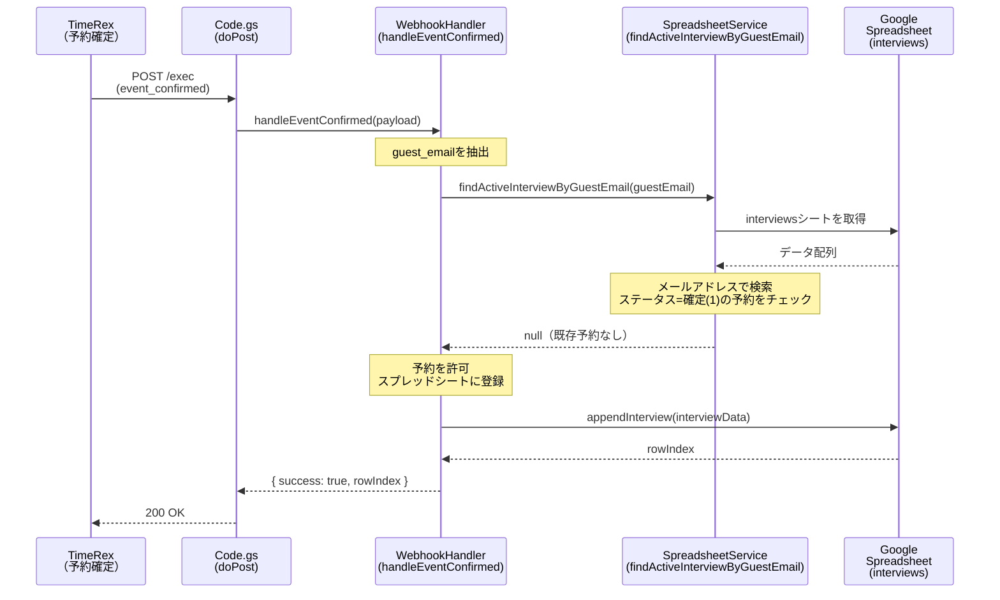
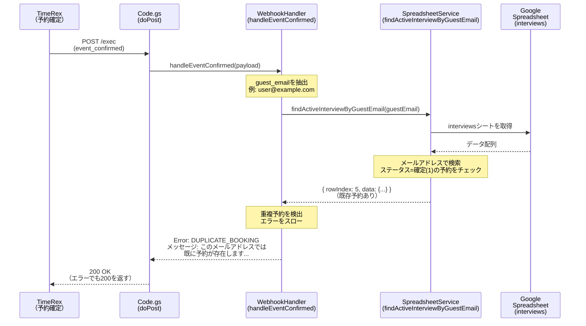
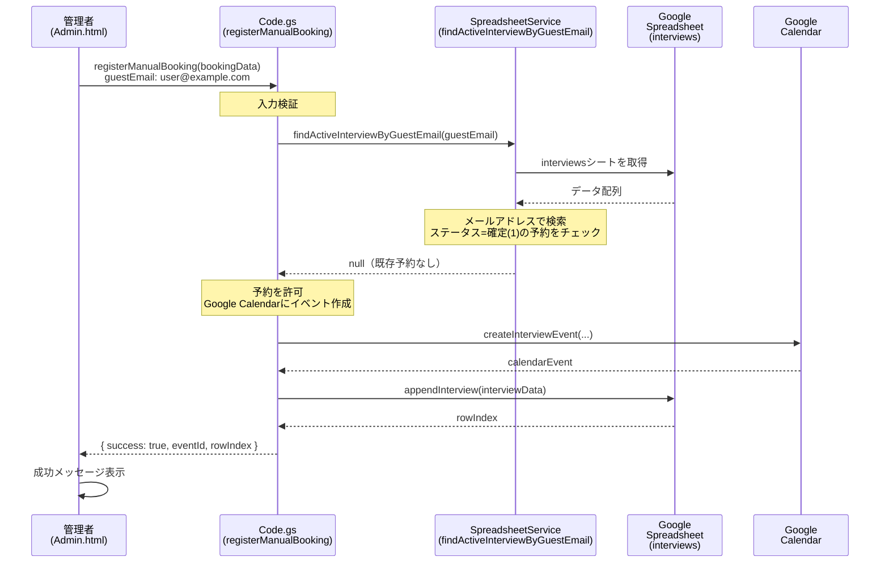
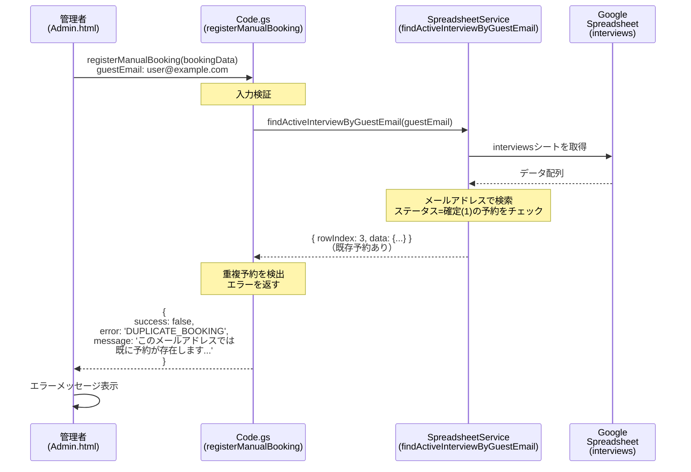
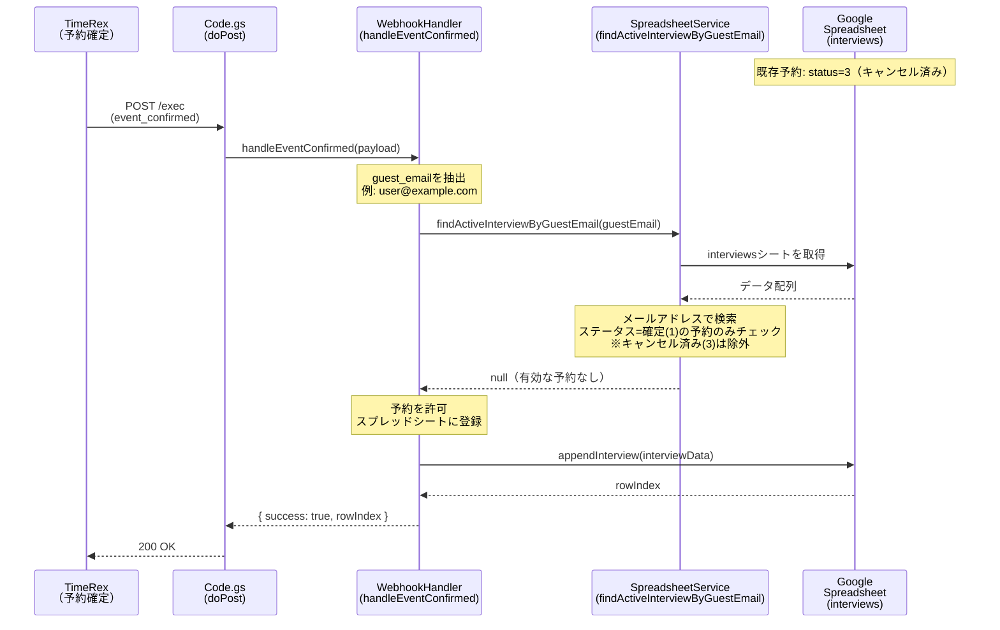

# 多重予約ブロック機能 シーケンス図

## 概要

同じメールアドレスからの重複予約を防ぐための機能です。有効な予約（ステータスが「確定」）が既に存在する場合、新しい予約を拒否します。キャンセル済みの予約は対象外とし、キャンセル後は再度予約可能です。

## ケース1: TimeRex Webhook経由での予約（正常系・重複なし）



## ケース2: TimeRex Webhook経由での予約（重複あり）



## ケース3: 管理画面からの手動予約登録（正常系・重複なし）



## ケース4: 管理画面からの手動予約登録（重複あり）



## ケース5: キャンセル後の再予約（正常系）



## 処理フロー詳細

### SpreadsheetService.findActiveInterviewByGuestEmail の処理

```
1. guestEmailパラメータを検証
2. interviewsシートの全データを取得
3. 各行をループ処理:
   a. GUEST_EMAIL列の値とguestEmailを比較（大文字小文字無視）
   b. STATUS列がCONFIRMED(1)かチェック
   c. 両方一致する場合、その予約情報を返す
4. 一致する予約がない場合、nullを返す
```

### チェック対象外

以下の場合は多重予約とみなされません：

- **ステータスが「キャンセル済み」(3)の予約**: キャンセル後は再度予約可能
- **ステータスが空または未設定の予約**: エラー状態の予約は除外

### エラーメッセージ

重複予約が検出された場合、以下のメッセージを返します：

```
このメールアドレス（{guestEmail}）では既に予約が存在します。
新しい予約をするには、まず既存の予約をキャンセルしてください。
```

## 実装ファイル

- **Webhook処理**: `src/WebhookHandler.gs` (103-111行目)
- **手動予約登録**: `src/Code.gs` (896-904行目)
- **重複チェック関数**: `src/SpreadsheetService.gs` (219-265行目)

## 注意事項

1. **メールアドレスの比較**: 大文字小文字を区別しない比較（`.toLowerCase()`）を使用
2. **ステータスの確認**: ステータスが「確定」(1)の予約のみをチェック対象とする
3. **キャンセル後の再予約**: キャンセル済みの予約はチェック対象外のため、キャンセル後は再度予約可能

